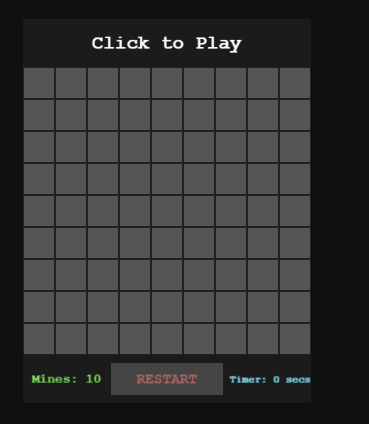
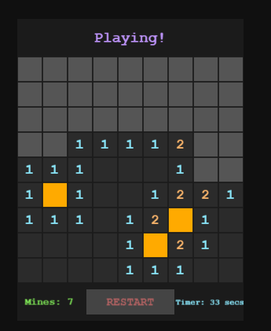
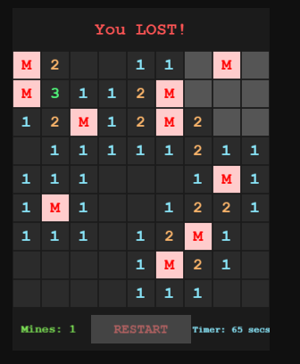
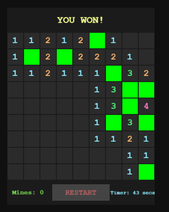

# Minesweeper-Clone-Using-Phaser
A simple Minesweeper clone built using JavaScript and the Phaser.js game framework.
This project was created as a beginner-friendly exercise to practice game logic, grid systems, and interactive UI handling.
---
# Features
- Classic 9x9 Minesweeper grid
- Randomly placed mines (with first-click safety)
- Recursive reveal for empty cells
- Flagging system (right-click)
- Win / lose detection
- Game restart button
- Live mine counter and timer
- Clean UI with color-coded numbers
---
# Running the Project
```
git clone https://github.com/cosminelulul/Minesweeper-Clone-Using-Phaser
Open index.html in your browser
Note: No build tools or dependencies required — runs directly in the browser.
```
---
# Possible Improvements
- Difficulty levels (Easy / Medium / Hard)
- Mobile support (touch controls)
- Sound effects and animations
- Better UI/UX polish
- High score system
---
# Screenshots!




